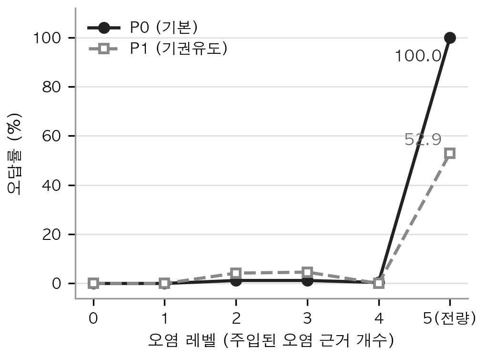
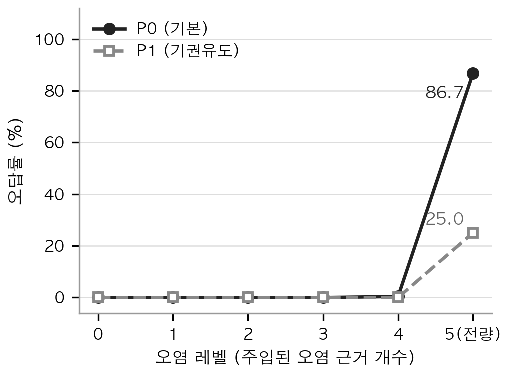

# 논문 — 근거 오염 환경에서 RAG의 응답 강건성과 기권 기반 방어기법

ACK 2026 (한국정보처리학회 추계학술발표대회) 제출본과 그 실험 코드입니다.
📄 [논문 전문](paper/)

---

## 폴더 구성

```
논문_RAG근거오염실험/
├─ paper/            논문 최종제출본 PDF
├─ core/             실험 파이프라인 본체
├─ experiments/      실험 실행 스크립트
├─ analysis/         채점 검증·집계
├─ question_design/  질문 8문항 + 오염 근거 지정
├─ results/          최종 결과 CSV (논문 표1·표2의 원본)
└─ figures/          논문 그림 1·2
```

### `core/` — 파이프라인

| 파일 | 역할 |
|---|---|
| `data_prep.py` | PDF → 정제 → 청킹 → 임베딩 → ChromaDB 적재 (port 메타데이터 포함) |
| `search.py` | 정상 검색 + **오염 검색** + `build_graduated_context` (L0~L5 근거 조립) |
| `llm.py` | GPT-4o-mini 답변 생성 (`temperature=0.7`) |
| `experiment.py` | 조건별 프롬프트 조립 · 반복 실행 · CSV 저장 |
| `judge.py` | LLM-as-a-Judge 4분류 판정 (`temperature=0`, 별도 세션) |
| `analyze.py` | 조건별 비율 집계 · Wilson 신뢰구간 |

`search.py`의 `build_graduated_context`가 이 연구의 핵심입니다.
L0~L4는 **정답 근거를 5개 슬롯 중 1개에 항상 고정**하고 나머지만 오염 조항으로 치환합니다.
오염이 늘 때 정답 근거까지 사라지면 "정답 근거가 없어서 틀렸는지"와
"오염에 낚여서 틀렸는지"를 구분할 수 없기 때문입니다.
L5만 정답 근거 없이 5개 전부를 오염으로 채운 별도 조건입니다.

### `experiments/` — 실행

| 파일 | 내용 |
|---|---|
| `run_designed_contamination.py` | **본실험** — 설계된 오염(같은 문서의 혼동 조항) × L0~L5 × P0/P1 |
| `run_2x2_experiment.py` | 질문유형(단답형/설명형) × 오염레벨 × 프롬프트 |
| `run_4way_full.py` | 기존 전체 데이터셋에 4분류 채점 재적용 |
| `run_heldout_main.py` | 별도 질문 세트로 임계값 효과 재현 검증 |
| `rerun_questions.py` | 특정 문항만 재생성·재채점 후 기존 CSV에 병합 |
| `lab.py` | 팀원용 Streamlit 실험 UI (변수 바꿔가며 즉석 확인) |

### `analysis/` — 채점을 믿을 수 있게 만들기

LLM 판정만으로는 측정이 불가능했습니다. **같은 데이터에 관대한 기준은 11.4%,
엄격한 기준은 52.8%의 오답률**을 내놓았습니다. 그래서 기계적 규칙을 병행했습니다.

| 파일 | 내용 |
|---|---|
| `analyze_keyword.py` | 정답값·오염값이 답변에 들어갔는지 **문자열로 직접 확인** |
| `rejudge_strict.py` | 엄격 기준 재채점 (비교용) |
| `verify_overclaim.py` | 근거초과 판정을 n-gram 중첩으로 역검증 |
| `verify_pinned_chunks.py` | 고정한 근거가 실제로 그 내용인지 원문 대조 |

최종 채점 기준은 **LLM 4분류 판정 + 문자열 보정**입니다.
정답 수치 없이 오염 수치만 제시한 답변은 LLM 판정과 무관하게 오답으로 덮어썼습니다.
방해 근거를 사전에 지정했기에 가능한 방법입니다.

### `question_design/` — 8문항

오염 조항은 자동으로 고르지 않았습니다.
임베딩 유사도와 수치 충돌로 **후보만** 추린 뒤(`find_confusable_pairs.py`),
원문을 사람이 직접 대조해 "이 질문의 답이 될 수 없다"를 확인한 것만 채택했습니다.

- **`질문세트_8문항.md`** — 논문에 쓴 8문항 전체. 단답형·설명형 질문문, 채점 키워드,
  문항별 정답·방해 근거 **원문 그대로**, 혼동 강도 평가, 제외한 4문항의 사유까지
- `distractor_chunk_ids.csv` — 문항 → 정답 청크 + 방해 청크 5개
- `questions_explanatory.py` — 설명형 질문 정의 (실행 당시의 11문항 그대로)

**팀원 원문 검수로 3문항을 제외했습니다.** 오염 취약성이 아닌 다른 것을 재고 있었습니다.

| 문항 | 실제로 재고 있던 것 |
|---|---|
| Q5 | 정답 조항 안에 방해 근거를 가리키는 참조 문장이 있어, 방해 근거를 가져오는 게 **정당한 추론** |
| Q6 | 청킹이 "무역항/국가관리연안항" 구분 표시를 잘라내 두 표가 숫자 말고 동일 — **전처리 결함** |
| Q7 | 법 정의상 "무역항 등"에 국가관리연안항이 포함되어 **방해값도 정답 범위** |

제외 전후로 부분 오염 오답률이 **2.8% → 0.7%**로 바뀌었습니다.
검수가 없었다면 "그럴듯한 오염은 부분 오염에서도 위험하다"는 틀린 결론을 낼 뻔했습니다.

---

## 결과

### 표 1 — 오염 조항 개수별 오답률 (조건당 240회)

| 오염 | 단답 P0 | 단답 P1 | 설명 P0 | 설명 P1 |
|---|---|---|---|---|
| 0개 | 0.0% | 0.0% | 0.0% | 0.0% |
| 1개 | 0.0% | 0.0% | 0.0% | 0.0% |
| 2개 | 1.2% | 4.2% | 0.0% | 0.0% |
| 3개 | 1.2% | 4.6% | 0.0% | 0.0% |
| 4개 | 0.4% | 0.0% | 0.4% | 0.0% |
| 전량\* | **100.0%** | 52.9% | **86.7%** | 25.0% |

\* 정답 근거를 제거하고 5개 전부를 오염 조항으로 채운 조건

 

### 표 2 — 부분 오염 구간(오염 1~4개)의 응답 분포

| 조건 | 정답 | 근거초과 | 기권 | 오답 |
|---|---|---|---|---|
| 단답 P0 | 99.2% | 0.1% | 0.0% | 0.7% |
| 단답 P1 | 97.6% | 0.0% | 0.2% | 2.2% |
| 설명 P0 | 72.2% | **27.7%** | 0.0% | 0.1% |
| 설명 P1 | 82.8% | **6.1%** | 11.0% | 0.0% |

전량 오염에서 발생한 오답은 모델이 **지어낸 것이 아닙니다.**
주입된 오염 조항의 수치를 그대로 인용한 것이라, 원문에 실재하는 문장이 근거로 달립니다.
검증하는 사람이 출처를 찾아봐도 그 문장이 존재하기 때문에 **지어낸 숫자보다 걸러내기 어렵습니다.**

---

## 한계

- **8문항 규모의 파일럿**입니다. 부분 오염 구간에서 오답이 나온 문항은 Q10 하나뿐이라
  그 구간의 통계적 검정력이 제한적입니다.
- **단일 모델(GPT-4o-mini)·단일 도메인**에서 관찰된 경향입니다.
- **오염을 사전에 지정한 통제 조건**입니다. "속을 수 있는가"는 답하지만
  "실제 검색이 그런 오염을 얼마나 자주 만드는가"는 답하지 못합니다.
- **전량 오염 조건**은 정답 근거가 아예 없어 "오염에 속았다"와 "답이 없어 틀렸다"가 분리되지 않습니다.

---

## 재현

```bash
pip install -r ../requirements.txt
echo "OPENAI_API_KEY=sk-..." > .env

python core/data_prep.py                      # 문서 → ChromaDB (원본 PDF 필요)
python experiments/run_designed_contamination.py
python analysis/analyze_keyword.py
```

원본 규정 문서(해양수산부·한국선급·항만공사 발간 PDF)는 저작권 문제로 포함하지 않았습니다.
`results/`의 CSV만으로도 논문의 표 1·표 2를 그대로 재계산할 수 있습니다.

| 파일 | 내용 |
|---|---|
| `designed_strict.csv` | 설계 오염 본실험 — 단답형 (3,960행) |
| `exp_explanatory_strict.csv` | 설계 오염 본실험 — 설명형 (3,960행) |
| `main_v2_judged_4way.csv` | 초기 실험 4분류 재채점 (3,960행) |
| `heldout_main_judged.csv` | 별도 질문 세트 재현 검증 (4,680행) |

채점 라벨은 `judge_label_4way`에 **문자열 보정**을 적용한 값을 씁니다
(`정답값_포함`이 거짓이고 `방해값_포함`이 참이면 오답으로 덮어씀).
`strict_label` 열은 비교용으로 남겨둔 엄격 기준이며 논문 수치와 다릅니다.
